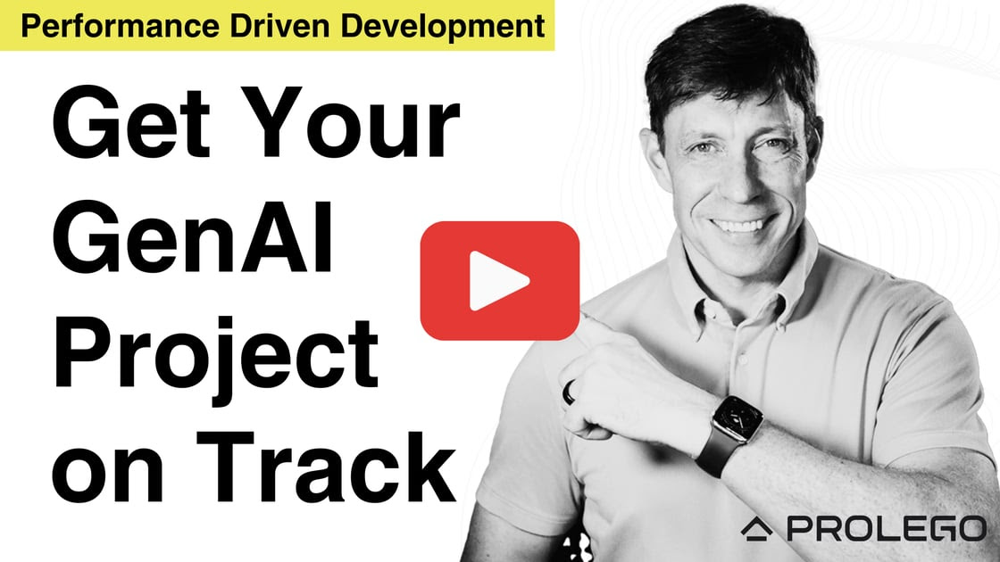
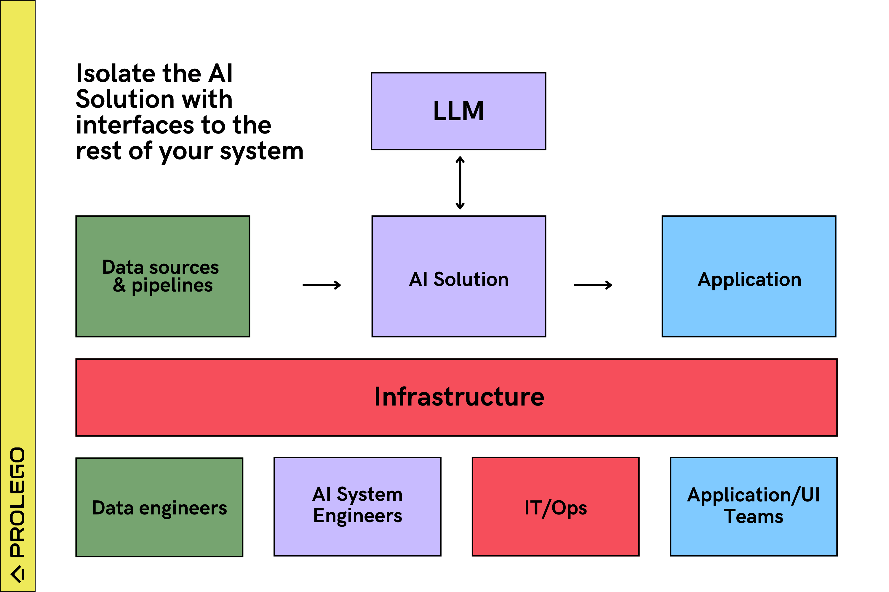

<!--
# PDD Style Guide

### General Guidelines
- **Consistency**: Maintain a consistent style throughout the document.
- **Tone**: Use a professional yet approachable tone. Engage the reader directly with "you."
- **Voice**: Prefer active voice over passive voice for clarity and directness.

### Capitalization
- **Titles and Headings**: Use Title Case for all headings. Example: `## Building a Performance Evaluation Framework`
- **Performance-Driven Development (PDD)**: Always capitalize "Performance-Driven Development" and use the acronym "PDD" after the first mention.
- **Performance Evaluation Framework**: Use sentence case for "performance evaluation framework," even when referring to it as a key term.
- **AI Solution**: Capitalize "AI Solution" when referring to the specific deployable system components.

### Formatting
- **Bold**: Use bold for key terms or phrases to highlight their importance. Example: "**AI solution**"
- **Italics**: Use italics for figure captions or to add emphasis in specific cases. Example: "*Figure Q1 - Segment the AI solution from the rest of your infrastructure through interfaces (e.g., JSON specs).*"
- **Lists**: Use bulleted lists for enumerating items or steps, and numbered lists for ordered processes.

### Punctuation
- **Commas**: Use the Oxford comma for clarity in lists. Example: "performance, cost, and speed."
- **Hyphens and Dashes**: Use hyphens for compound modifiers (e.g., "large-scale project") and em dashes for interruptions or additional emphasis (e.g., "PDD isn't hard—just different").

### Language
- **Technical Terms**: Explain technical terms briefly when first introduced, then use them consistently.
- **Acronyms**: Spell out acronyms upon first use, followed by the acronym in parentheses. Use the acronym in subsequent mentions. Example: "Large Language Models (LLMs)."

### Structure
- **Introduction**: Start with a welcoming and context-setting introduction.
- **Headings**: Use clear and descriptive headings to guide the reader through the document.
- **Conclusion**: End sections with a summary or next steps where applicable.

### Examples
- **Correct**: Performance-Driven Development (PDD)
- **Incorrect**: Performance-driven Development (PDD)

- **Correct**: performance evaluation framework
- **Incorrect**: Performance Evaluation Framework
-->

# Get Your GenAI Project on Track
Welcome! You're here because your GenAI project is stuck, and you want to get it back on track.

Building with large language models (LLMs) is fast, but transparency is challenging. It’s tough to know where your application excels, avoid critical errors, make improvements, and predict readiness.

That’s where Performance-Driven Development (PDD) comes in. PDD gives you the clarity you need to confidently manage and deploy GenAI applications.

### How PDD Gets Your GenAI Project on Track

| **GenAI Challenge**   | **Your Current Situation**                                       | **Better With PDD**                                                      |
|-----------------------|-----------------------------------------------------|-------------------------------------------------------------------|
| **Performance**       | You rely on general observations from demos and "iterate by feel" | You can quantify performance and optimize based on measurable limitations           |
| **Cost and Latency**  | You can only provide general estimates, optimized at the app level | You forecast cost and speed, and optimize both for users and tasks |
| **Robustness**        | You experience inadvertent breaks or degradation during improvements | You ensure systematic improvements with consistent performance     |
| **Schedule**          | You face unpredictable schedules due to continuous experimentation | You follow a predictable schedule based on ongoing system improvements |

I started this project based on [Prolego's](https://prolego.com) experiences helping clients with AI projects. [More background](#why-i-created-the-pdd-project).

--*Kevin Dewalt*. Contact me on [LinkedIn](https://www.linkedin.com/in/kevindewalt/) or kevin@prolego.com

### Contents
- [Quickstart](#quickstart)
- [Why GenAI Needs a New Approach](#why-genai-needs-a-new-approach)
- [Performance-Driven Development Methodology](#performance-driven-development-methodology)
    - [Logically Isolate AI in Your Systems](#logically-isolate-ai-in-your-systems)
    - [Create a Team of AI Systems Engineers](#create-a-team-of-ai-systems-engineers)
    - [Build a Performance Evaluation Framework](#build-a-performance-evaluation-framework)
    - [Iteratively Optimize Your Solution with Customers](#iteratively-optimize-your-solution-with-customers)

- [Example: Get a RAG Solution on Track](#example-get-a-rag-solution-on-track)
- [About](#about)

---

# Quickstart
Large language models (LLMs) allow rapid development of powerful solutions, but they often produce inconsistent and unpredictable results. You can quickly create a proof-of-concept that mostly works, but pinpointing successes, failures, improvements, and project completion can be challenging. This lack of transparency frustrates you and your leadership. Here's how to get your LLM project on track.

## Three-Minute Video Intro

## Designing Your Systems and Teams
Separate your AI solution—the components interfacing with LLMs—from the rest of your infrastructure. Assign a team of [AI systems engineers](#create-a-team-of-ai-systems-engineers) to work on it, as shown in Figure Q1.

*Figure Q1 - Segment the AI solution from the rest of your infrastructure through interfaces (e.g., JSON specs).*

## Building a Performance Evaluation Framework

Your AI systems engineers will build the AI solution using a [performance evaluation framework](#build-a-performance-evaluation-framework), which provides transparency into your LLM project. This framework includes four parts, as shown in Figure Q2:

1. A representative **set of data and tasks** covering the scenarios the LLM will encounter.
2. The **AI solution**—interfaces to LLMs, prompts, tools, agents, orchestrations, and data preparation, forming the deployable solution from Figure Q1.
3. An **evaluation workflow** that generates performance results based on your data and tasks.
4. A **performance report** showing how well your solution works, its cost, and its speed.

*Figure Q2 - Create transparency with a performance evaluation framework.*

Use the performance report to gather customer feedback and iteratively improve your framework. Deploy your AI solution when it meets the necessary performance standards.

## PDD Isn't Hard—Just Different

This approach, called Performance-Driven Development (PDD), focuses on getting the LLM to perform as needed.

While PDD may seem complex, it’s simply a different way to approach LLM-powered projects. You can build your first performance evaluation framework in 15 minutes using generated data and spreadsheets.

---

# Why GenAI Needs a New Approach
Your leadership has finally approved funding for your first generative AI project. You gather data and begin building your proof of concept (POC). Here’s what to expect over the next 3-6 months:

- Rapid early results will excite customers, but progress will slow as engineers disagree on the best path for improvements.
- Stakeholders will ask, “How do you know it works?” and “When will you be done?”—and you won’t have clear answers.
- A team member will unintentionally degrade the solution, leading to weeks of troubleshooting. Progress will slow further as the team works to prevent similar issues.
- Customers will lose interest due to a lack of visible progress, and stakeholders will grow impatient as you struggle to explain where the system stands and when it will be completed.

And then … nothing good happens for you or the project because you’re stuck.

Unfortunately, even experienced software engineers and data scientists find themselves stuck because traditional methodologies and tools don’t address the challenges of GenAI.

## LLMs Are Powerful Technologies with Unique Risks
Traditional software development is notoriously challenging. Business logic must be embedded in arcane languages like C or Python to instruct computers on how to perform tasks. This code doesn’t generalize well, and even the smallest error can render a system useless. Over the past 50 years, we’ve developed methodologies, tools, and frameworks to make this process more efficient. Agile and Lean Startup methodologies help us avoid building products nobody wants, while frameworks like Ruby on Rails reduce the amount of code we need to write.

### LLMs Massively Increase Developer Productivity—But at a Cost
Generative AI, particularly through large language models (LLMs), offers a more efficient way to build software because it has knowledge of the world and can complete tasks with general direction.

For example, I can instruct an LLM to “remove the comments from this Python script,” and it will do so flawlessly because it understands what a Python comment is. This is far more efficient than writing 20 lines of Python to search for ‘#’ and ‘//’ characters and carefully delete them without affecting the rest of the code.

Generative AI will ultimately enable smaller teams to build more powerful software in less time. However, this power comes with a trade-off: *LLMs are stochastic*. For any given task, an LLM may produce different results each time or even hallucinate—generating convincing responses that are incorrect.

Table 1 highlights ways GenAI projects are different.

## Key Differences Between Traditional Software and GenAI
| Attribute        | Traditional Software       | GenAI                       |
|-----------------------|----------------------------|-----------------------------|
| **Developer Interface** | Compiler or interpreter    | LLM API                     |
| **Interface Behavior**  | Deterministic              | Stochastic                  |
| **Primary Risk**        | Market / Adoption          | Technical                   |
| **Solution Logic**      | Written in code            | Inherent in LLM             |
| **Rate of Change**      | Linear                     | Exponential                 |
| **Frameworks / Practices** | Mature                 | [Emerging](./Projects.md)                |
| **Iteration Cycle Time**  | Weeks (Sprints)        | Hours                       |

*Table 1 - LLMs are a new programming interface with different risks than traditional software.*

You’re stuck because you’re trying to apply traditional software product management and engineering principles to GenAI projects. Here is how these differences manifest:

### Ensuring System Resilience
In traditional software engineering, unit, functional, and integration tests ensure that deterministic functions produce specific outputs from specific inputs. While you still need tests in GenAI to prevent bugs in your Python libraries, a different approach is required to ensure LLMs perform as desired.

Just as a developer can write a software function in many ways, LLMs can produce correct results through various approaches. Moreover, LLM outputs don’t conform to simple pass/fail evaluation criteria. An LLM can generate a result that is mostly correct and still effectively solve the business problem. Conversely, slight wording or formatting changes in a prompt that appear identical to a human evaluator can cause a system to fail catastrophically.

### Planning for Technology Changes  
Best practices and tools in traditional software engineering don’t evolve as rapidly. Whether you build your product with Ruby on Rails Version 6 or 7 won’t significantly impact its success. A great programmer using a 10-year-old tech stack will still outperform an average programmer using modern tools.

In contrast, the difference between LLM versions, like GPT-3.5 and GPT-4, is so significant that it could either improve your product by 90% or render it obsolete. No level of developer skill can bridge the gap between generating text with GPT-2 and GPT-4.

### Providing Transparency  
Providing transparency in traditional software projects is challenging, which is why the industry has developed methodologies like Agile, tools like Jira, and roles like Scrum Master to offer some degree of predictability. Even with these, it remains difficult for project managers to predict when software projects will be completed and how well they will perform. GenAI projects are even more complex.

With no clear way to predict how an LLM will perform, teams struggle to describe how well their solution is working. Unlike traditional software, you can't predict when a GenAI project will be complete because you don’t know what obstacles you’ll face or how you'll overcome them. Additionally, it's difficult to quantify the effectiveness or improvement of your GenAI project.

---
# Performance-Driven Development Methodology
Here are four steps for getting your GenAI project on track.
1. [Logically Isolate AI in Your Systems](#logically-isolate-ai-in-your-systems)
1. [Create a Team of AI Systems Engineers](#create-a-team-of-ai-systems-engineers)
1. [Build a Performance Evaluation Framework](#build-a-performance-evaluation-framework)
1. [Iteratively Optimize Your Solution with Customers](#iteratively-optimize-your-solution-with-customers)

## Logically Isolate AI in Your Systems
Isolating AI components from the rest of your system’s architecture enables team specialization, scalable and consistent AI capabilities, faster adoption of new models, and transparency.

### Tightly Integrating LLM API Calls Creates Scaling Challenges
Many teams begin their GenAI projects by adding LLM API calls within their existing code libraries, as shown in Figure PD1. 

*Figure PD1 - You can begin a GenAI project by adding LLM API calls within your existing data workflow and applications. While this design works for simple, low-risk tasks, it doesn’t provide the transparency and predictability needed for most workflows.*

While this is a quick way to start and works for simple, low-risk tasks, it creates scaling challenges:

- It obscures what the LLM is doing.
- It prevents rapid testing and integration of new LLMs and approaches.
- It creates code redundancy.

### Create Interfaces with Your AI Solution
A more effective approach is to isolate the AI components of your system—such as LLM interfaces, prompts, prompt orchestration agents, and tools—from the rest of the system's architecture, as illustrated in Figure PD2.

*Figure PD2 - Logically isolate your AI solution from the rest of your system. The AI solution consists of components that optimize the LLM’s performance, such as prompts, data preprocessing, prompt orchestrations, and tools.*

This design has several scaling advantages:

- It allows you to build a team of AI systems engineering specialists.
- It lets you offer similar AI capabilities, such as text processing, across the company.
- It enables quicker adoption of new LLMs or approaches.

Finally, it allows you to create transparency by building an LLM performance evaluation framework.

### Avoid LangChain and Similar Frameworks
At best, frameworks like LangChain make it slightly easier to solve simple problems. Unfortunately, they further obscure what your LLM is doing and reduce transparency. We have yet to encounter an experienced team that recommends them for production.

## Create a Team of AI Systems Engineers

Building solutions with LLMs isn’t traditional data science, programming, or machine learning. LLMs are a new programming interface, and it takes 6-12 months to become proficient. We call this role an *AI systems engineer*, combining a data scientist’s experimental mindset with a systems engineer’s big-picture view.

Here is an [AI systems engineer job description](https://www.prolego.com/reports/ai-systems-engineer-job-description) and a video, [The Surprising Skills You Need to Build LLM Applications](https://youtu.be/Wp6LP8yk4I8).

Engineers from data science, software engineering, or systems engineering backgrounds can transition into this role with time and dedication. Even product and project managers with minimal technical experience are successfully building LLM-based solutions.

AI systems engineers will build the components that optimize the LLM’s performance, as shown in Figure PD2 above, through a performance evaluation framework.

## Build a Performance Evaluation Framework
You need a new approach for building solutions with LLMs, one that provides granular visibility into how well your solution is working. A performance evaluation framework, as illustrated in Figure PD3, provides this transparency.

*Figure PD3 - A performance evaluation framework creates transparency into how the LLM is performing. It consists of (1) data and tasks, (2) AI solution, (3) evaluation workflow, and (4) performance report.*

The framework consists of four components:

1. A representative **set of data and tasks** covering the scope of the problem.
2. The **AI solution** you will deploy.
3. An **evaluation workflow** that runs the representative set of data through your solution and evaluates its performance on the tasks.
4. A **performance report** showing how well your solution works and calculating key metrics.

Let's walk through each.

### 1. Representative set of data and tasks
The foundation of your framework is a representative set of data and tasks tailored to the solution you’re building. Table 2 lists examples for common LLM solutions.

| **LLM Solution**           | **Data**                   | **Tasks**                                            |
| ---------------------- | ---------------------- | ------------------------------------------------ |
| RAG                    | Source documents       | Questions and expected answers                   |
| Document classification| Set of documents       | Expected classification of each                  |
| LLM to SQL             | Populated database tables | Questions and expected results from SQL queries |

*Table 2 - Examples of performance evaluation framework data and tasks designed to provide granular transparency.*

This set should cover the full scope of the problem space and be used to evaluate the solution's effectiveness. If hallucinations or mistakes are concerns, create tasks specifically designed to test how the solution handles these issues.

Continuously update and revise this set as long as the solution is in production, and generate new tasks when adding data, changing tasks, or encountering operational anomalies. When legal concerns arise, such as "*what if x occurs...*," create a task to demonstrate how the solution addresses it.

Developing a representative set requires significant experience, experimentation, and iteration. The key challenge is determining the right quantity and type of tasks to cover common scenarios and critical edge cases without generating redundant files that don't enhance system robustness.

Some teams also use generated data to mitigate security and legal risks, enabling faster and more efficient testing of new LLMs.

### 2. AI solution
The AI solution is the software that transforms the input data into an output by interacting with the LLM: 

- Prompts
- Data processing scripts
- Interfaces
- Prompt orchestration libraries
- Agents
- Tools

The AI solution is what you will deploy into production as discussed previously in [Create Interfaces with Your AI Solution](#create-interfaces-with-your-ai-solution).

### 3. Evaluation workflow
You need a scalable way to measure how well your system is performing by running the representative tasks and data sets through your solution and comparing the expected vs. actual outputs.

Table 3 lists three common options teams are currently using.

| **Evaluation Option** | **Description**                                               | **Pro**                                                  | **Con**                                      |
| ----------------- | --------------------------------------------------------- | ---------------------------------------------------- | ---------------------------------------- |
| Manual inspection | Developer visually inspects expected and actual outputs   | Easiest to start. Most likely way to ensure accuracy. | Slow. Won’t scale.                       |
| Scripts           | Python scripts detecting presence or absence of words     | Relatively easy to set up. Good at catching obvious errors. Runs fast. | Tedious to maintain. Can miss edge cases. |
| LLMs              | Send the expected and actual results to an LLM with instructions to evaluate. | Accuracy of manual inspection at scale. | LLMs are still not very good at it. Can get expensive.      |

*Table 3 - Three techniques for evaluating your AI solution’s performance.*

OpenAI and others have advocated for using LLMs for your evaluation. In practice, most teams have found the combination of human review, Python scripts, and LLMs to be necessary.

Additionally, your evaluation workflow will gather key system metrics such as cost, token count, and latency. It must also provide transparency into the LLM’s sensitivity, such as running the LLMs at different temperatures to generate a confidence interval.

### 4. Performance evaluation report
Finally, your framework will have a performance evaluation report that provides transparency into your solution. The report should offer granular performance visibility into every task in your set and higher-level solution metrics.

The evaluation report typically contains the following for every task:

- A confidence score comparing the actual vs. expected performance by the LLM.
- The specific LLMs used (e.g., GPT-4, LLama3-8b).
- Cost or token count.
- Latency.
- Notes or recommendations for improving performance.

[Figure PD3](#build-a-performance-evaluation-framework) has a simple example.

Spreadsheets are perfectly fine for performance evaluation reports. You can import CSV files generated by Python scripts as new tabs, and both engineers and customers can quickly do analysis and provide feedback.

## Iteratively Optimize Your Solution with Customers
Figure PD4 illustrates the conceptual workflow for leveraging PDD in your existing processes. 

*Figure PD4 - Your AI team needs to operate independently and at a faster cycle time than the rest of your team. During a typical two-week sprint, an AI systems engineer will make dozens of improvements to their performance framework, and more powerful LLMs will be released. You can still deploy the AI solution according to your existing workflow.*

Isolating the AI solution from the rest of the system architecture allows AI systems engineers to work at a faster pace and focus on the risks associated with stochastic behavior.

1. Build your performance evaluation framework:
    1. Generate a representative set of data and tasks for the LLM.
    2. Create the AI solution to address these tasks.
    3. Evaluate how well your solution meets expectations.
    4. Generate a performance report.
2. Review your performance report with your customer and gather feedback.
3. Repeat steps 1 and 2 until your solution performs adequately.
4. Create interfaces between your AI solution and the rest of your system workflow.
5. Deploy your solution through your existing processes.

Continue this process, and increasingly offload more work to the LLM as AI improves.

### Best Practices
#### Prioritize Tasks That LLMs Can Perform Well Today
AI is improving at an exponential rate, and tomorrow’s LLMs will be better at solving your problems. Teams have wasted months optimizing solutions for LLM limitations like speed or reasoning power, only to discard this work when better LLMs and hardware are released. Prioritize tasks the LLM can perform without customization before tackling harder ones.

#### Start with the Easiest Optimization Choices
Of the available [13 LLM optimization techniques](https://go.prolego.com/playbook), begin with simpler ones like optimizing prompts or testing different LLMs. Only pursue complex solutions like fine-tuning or agents when easier approaches are insufficient.

---
# Example: Get a RAG Solution on Track
Let’s walk through a simple example. The source code, installation instructions, and reports are in the [Example-RAG-Formula-1](/Example-RAG-Formula-1/) directory.

## Goal: RAG on the Formula 1 Rules
In [Episode 17 of our Generative AI Series](https://www.youtube.com/watch?v=LmiFeXH-kq8) we demonstrated a LLM Retrieval Augmented Generation (RAG) chat application built on the regulations issued by Formula 1’s governing body, the Fédération Internationale de l'Automobile (FIA). We also: 
- [held a demo and detailed technical discussion](https://www.youtube.com/watch?v=Y_Nr9-IWF8o), 
- [published a study](https://go.prolego.com/llm-rag-study) on the importance of context for RAG, and
- shared the results [on a Webinar with Pinecone](https://www.youtube.com/watch?v=GkQ52svNUhM).

The application allows fans to ask detailed questions about the sport’s rules. Figure E0 is a screenshot.

*Figure E0 -  A screenshot of The FIA Regulation Search RAG application answers user questions about the sport’s complex rules.*

## A Good Start with a Basic RAG Demo
You opt to build a retrieval-augmented generation (RAG) solution for your employee policies, as shown in Figure E1. A subset of the policy documents is converted into embeddings and stored in a vector database. You then set up the interaction with the LLM and configure Gradio as the user interface.

*Figure E1 - A basic RAG workflow for unstructured text documents.*

You configure the demo to allow employees to ask policy questions and receive an answer accompanied by references to the relevant source documents.

### First Feedback from HR
HR loves your demo and immediately sees how it will reduce their workload. They begin asking common questions about vacation policies, performance reviews, and travel, and provide initial feedback. You start taking notes:

- The demo successfully answers basic questions covered by the indexed policies but struggles with questions related to unindexed policies and occasionally hallucinates, generating incorrect answers. You advise HR to limit their queries to the indexed policies.
- Some answers are misleading or confusing, but HR notes that the policies themselves are unclear on these points. In practice, HR often relies on state employment laws and current industry best practices to clarify these issues.
- When HR asks more complex questions, the solution fails to provide accurate answers. In some cases, it misses information from tables and diagrams that were ignored during setup. In others, it struggles to reason through information spread across different sections of the documents.
- HR also raises a concern that legal might not approve employee use of the solution until there are assurances it won’t expose the company to liabilities.

## And … You’re Stuck
After reviewing your notes, you're uncertain about the next steps. HR clearly wants the solution, but you're unsure how to develop a plan for production deployment.

The biggest challenge is defining the problem more clearly. You don't yet know the specific questions employees will ask or the most accurate answers to provide.

You have several ideas for improvements, such as adding more policies, parsing documents by page instead of paragraph, refining system prompts, incorporating additional sources like state employment laws, experimenting with different LLMs, fine-tuning the LLM, capturing data from complex structures like tables and figures, and using agents to handle more complex reasoning. However, you're unsure how to prioritize these options.

Given the ambiguity, you decide to build a performance evaluation framework.

## Building Your Performance Evaluation Framework

### Generate a Representative Set of Data and Tasks
You start by building a spreadsheet of expected questions and correct answers, like Table 4:

| **Question**                                                          | **Expected Answer**                                                                                   |
| ----------------------------------------------------------------- | ------------------------------------------------------------------------------------------------- |
| If I am late for work, can I make up the time from my lunch break?| No. The handbook mentions that breaks from work are a privilege and cannot be used to account for an individual's late arrival or early departure. |
| I want to work another part-time job in the evenings and weekends. Is this allowed? | Yes, if you notify your manager and HR, and the second job does not interfere with your primary job here. You must complete the "Disclosure of Outside Employment" form. |

*Table 4 - The initial set of representative tasks for your RAG solution.*

HR reviews your questions and confirms the correct answers.

### Create an Evaluation Workflow
You build scripts and configuration files to do the following:

1. Send the questions to your solution.
2. Generate an actual answer.
3. Calculate key metrics like cost and speed.
4. Record the relevant section from the policies.
5. Store the results in a CSV file.

### Generate a Performance Report
You import the evaluation results into Excel, visually analyze the results, and record a confidence score (High, Medium, Low) based on your reading of the policies, like Table 5.

**Performance Report**

| **Question**                                                                                     | **Expected Answer**                                                                                   | **Actual Answer**                                                                                   | **Confidence** | **Source**                                           | **Metrics**         |
| -------------------------------------------------------------------------------------------- | ------------------------------------------------------------------------------------------------- | ----------------------------------------------------------------------------------------------- | ---------- | ------------------------------------------------ | --------------- |
| If I am late for work, can I make up the time from my lunch break?                           | No. The handbook mentions that breaks from work are a privilege and cannot be used to account for an individual's late arrival or early departure. | No. Breaks from work are a privilege and cannot be used to account for an individual's late arrival or early departure. All employees are expected to adhere to their scheduled work hours… | High       | Section 5: Attendance and Break Policies        | 2.3s, $.0003    |

*Table 5 - Performance report for the RAG solution*

## Productive Feedback
Instead of presenting a demo, you share your performance evaluation report with HR. This time, they offer specific feedback on the questions, expected answers, and confidence scores.

HR also provides insights into the reasons behind poor performance, such as missing source material, ambiguous questions, or general confusion. With this feedback, you quickly identify the most impactful improvement: embedding entire sections of the policy documents instead of just paragraphs.

Your next weekly project status report is well received. Instead of sharing general updates about demos and testing, you present the performance report and explain your decision to change the embedding workflow before exploring more complex options.

## Continuous Improvement Through PDD
You quickly get into a productive workflow with HR. They review your performance report in Excel, add questions, review your results, and provide context. They also add a few high-risk questions that could create liability concerns from legal.

You make rapid solution improvements by investing in straightforward changes such as adding documents, improving embeddings, and tweaking prompts. You also continuously improve your evaluation workflow and build scripts to automatically generate results. The performance framework allows you to make changes with confidence.

## You’re No Longer Stuck
PDD has effectively addressed your primary challenges:

- You now have transparency into where your solution is performing well and where it’s falling short.
- You have a method for managing the stochastic behavior of LLMs.
- You can focus on the highest-impact improvements rather than relying on trial and error.
- You can detect potential issues in your solution early.

Additionally, you’ve gained the confidence of your leadership. You’re able to demonstrate consistent progress, provide clear transparency, and estimate when your solution will be ready for production.

---
# About 
## Why I Created the PDD Project
*by [Kevin Dewalt](https://www.linkedin.com/in/kevindewalt/)*

I’ve been programming computers for over 40 years, and the arrival of generative AI marks the most significant shift in software engineering I’ve ever seen. Large Language Models (LLMs) are set to revolutionize the field, enabling smaller teams to build more powerful solutions at unprecedented speeds, while drastically reducing development costs. This efficiency will allow us to create AI-powered applications that not only outperform current alternatives but also tackle increasingly complex problems.

We’re standing on the brink of a new golden era for software engineering, but two major obstacles stand in our way. First, AI is still in its infancy, and LLMs are not yet adept at solving most business problems. Extensive customization is required to enable LLMs to access structured data or perform beyond basic reasoning. The good news is that LLMs are improving at an exponential rate, and we can expect many of these challenges to be resolved within the next two years.

The second challenge is that we lack effective methodologies for developing solutions with LLMs. Many teams are trying to repurpose existing tools and approaches, with mixed results. Application frameworks like Ruby on Rails and Django revolutionized data-driven web development, but frameworks like LangChain are currently hindering efficiency. Similarly, product strategies like Agile and Lean Startup, which are designed to mitigate adoption and market risks, are distracting teams from the more pressing challenge of getting LLMs to perform as intended.

As a result, many LLM projects are stalled. Teams struggle with a lack of transparency into how their solutions are functioning, and they lack the tools to determine whether they should refine their models through fine-tuning or by implementing more complex prompt orchestration. They can’t predict when their solution will be good enough or how much it will cost. Even worse, many are investing time and resources into building software that will be obsolete within two years.

Fortunately, the most effective engineering teams are pioneering a new approach, which we call Performance-Driven Development (PDD). This methodology addresses the two central challenges of working with LLMs: (1) they behave stochastically, and (2) they are improving at an exponentially-fast rate. PDD will help you get LLMs to perform as desired.

My journey with PDD began in April 2023, after reading [Sparks of Artificial General Intelligence: Early experiments with GPT-4](https://arxiv.org/abs/2303.12712), by Sébastien Bubeck et al. It became immediately clear that software engineering as we knew it was about to undergo a permanent transformation. I began developing LLM-based solutions with Justin Pounders and other engineers at Prolego, sharing our findings through open-source examples and [weekly YouTube videos](https://www.youtube.com/channel/UCLx-I9NTlkPRFzJtsB9_EEw). We also engaged with numerous teams and reviewed case studies from companies that were seeing early success.

Over time, it became clear that much of my previous experience in software, machine learning, and data science didn’t apply to generative AI. I was struck by how quickly our team could build solutions and how little actual code was required. At the same time, I realized the importance of maintaining transparency into how LLMs were performing at the task level to avoid getting stuck in a perpetual cycle of “iterate by feel.” We also connected with other engineering teams who were converging on similar issues.

By April 2024, the key concepts of PDD had crystallized, and we began integrating performance evaluation frameworks into our client work. Partnering with our clients’ engineering teams, we were able to turn around stalled projects in a matter of weeks, providing the transparency and predictability they needed. PDD proved so effective that Russ and I decided to refocus Prolego entirely around this methodology.

This project is my attempt to document the PDD methodology, based on what’s actually working for those of us who make a living by delivering solutions that solve real problems. If that resonates with you, I hope this guide helps you as much as it’s helped us—and that together, we can continue to push the boundaries of what’s possible.

## Contribute
Please submit issues and pull requests of your suggestions or feedback. Or email me at kevin@prolego.com.

## Acknowledgments
LLMs are new, and unfortunately, separating the AI hypesters and the real practitioners isn’t easy. Here are some pros whose work I admire who helped make this document better.

Thank you Justin Pounders, [Craig Dewalt](https://www.linkedin.com/in/craigdewalt/), [Shanif Dhanani](https://www.locusive.com/) for reviewing the early, ugly drafts.

**Copyright**
Copyright 2024, Prolego, Inc. All rights reserved. 